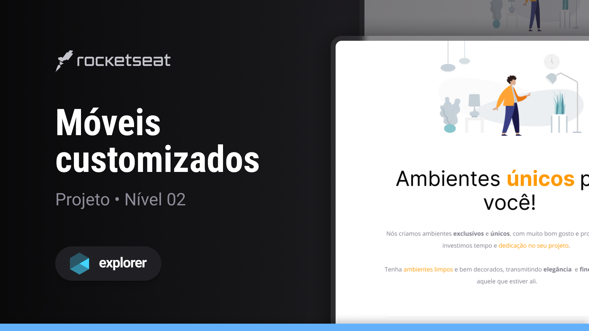
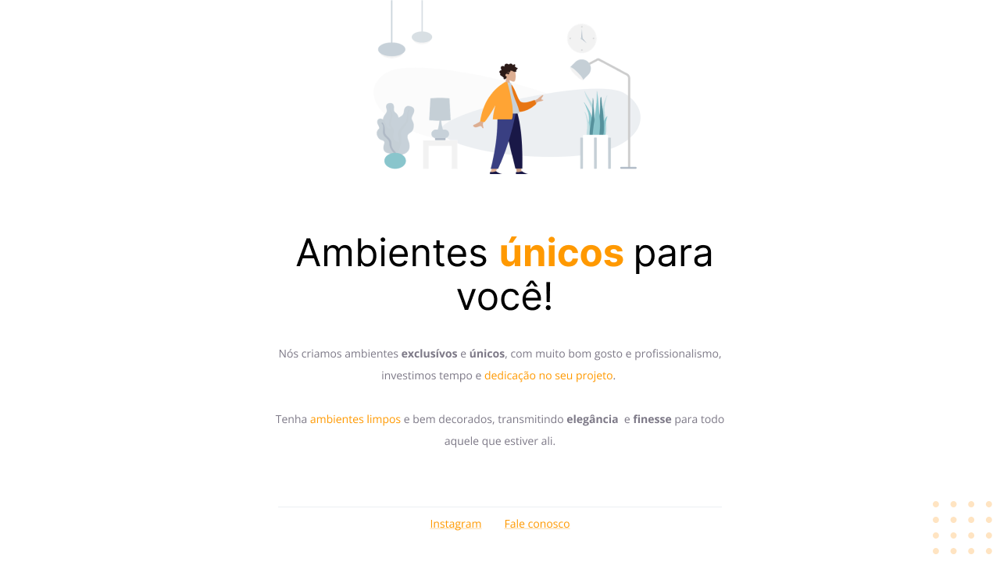

## Sobre o projeto

O projeto apresenta uma interface web descomplicada, erigida como parte do itinerário Explorer oferecido pela Rocketseat. 
O objetivo principal é explorar conceitos essenciais de organização semântica e flexbox. Ao longo das sessões, foram empregados os seguintes princípios:

## Ideias Aplicadas
###
* Fundamentos de HTML e CSS em uma abordagem semântica
* Aprendizado da utilização da ferramenta Figma
* Implementação de estilos e paletas personalizados em nossos projetos
* Compreensão da disposição e espaçamento dos elementos através dos conceitos de Modelo de Caixa e Flexbox do CSS.

## Tecnologias
- HTML
- CSS
- Figma

## Layout do projeto
<table>
  <tr>
    <td></td>
  </tr>   
</table>

## Demonstração
Segue uma prévia do resultado final do projeto elaborado:
[Link Demonstração](https://rs-ferreira.github.io/MoveisCustomizados/)

## Desafio
A partir desta iniciativa, foi lançado um desafio para recriar o design utilizando os mesmos princípios, 
mas com uma temática distinta. Para mais informações sobre o desafio, acesse  
[recriando-layout](https://rs-ferreira.github.io/Flutuar.com/)

## Contato
aso haja alguma dúvida ou deseje entrar em contato, sinta-se à vontade para me enviar uma mensagem pelo
LinkedIn (https://www.linkedin.com/in/ronaldosf).

<a href="#readme-top">voltar ao topo</a>

